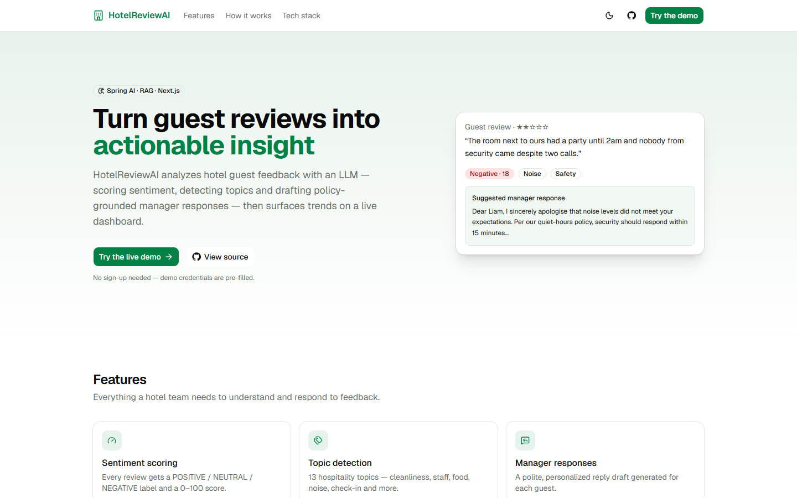
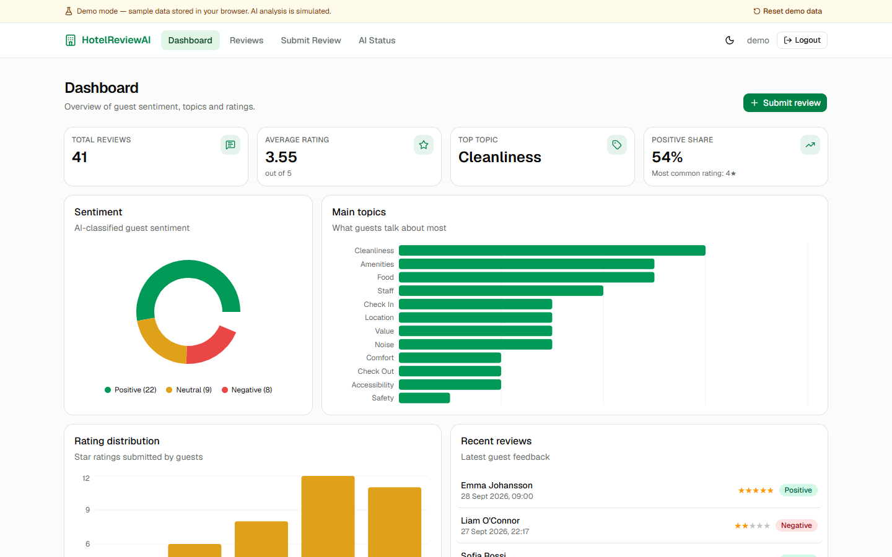
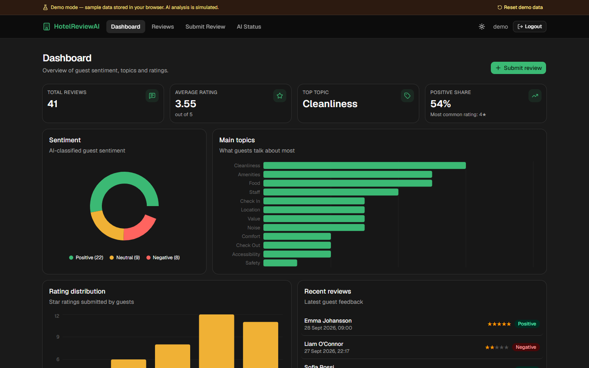
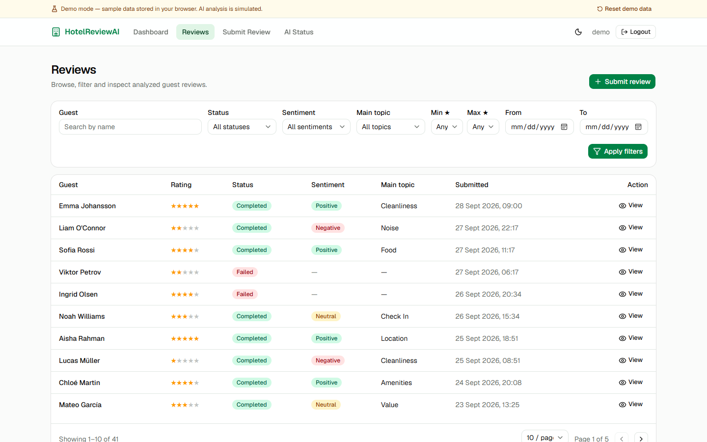
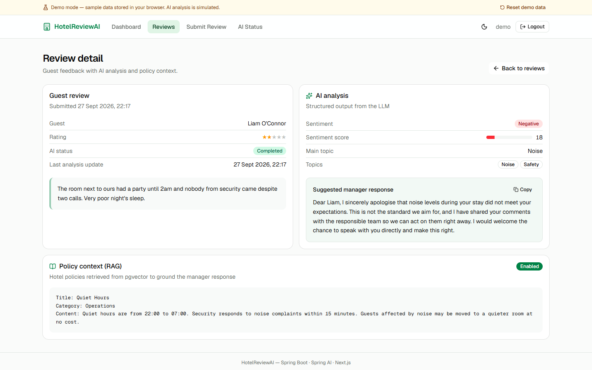
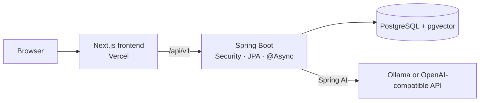

# HotelReviewAI

AI-powered hotel guest review analyzer built with Spring Boot 3, Spring AI, PostgreSQL/pgvector and a Next.js frontend.

**Live demo:** https://hotel-review-two.vercel.app (runs on in-browser sample data; demo login is pre-filled)



## Features

- **Sentiment scoring**: POSITIVE / NEUTRAL / NEGATIVE with a 0–100 score
- **Topic detection**: 13 hospitality topics (cleanliness, staff, food, noise, check-in, …)
- **Manager responses**: a personalized reply draft for every review
- **RAG policy grounding**: relevant hotel policies retrieved from pgvector are injected into the prompt
- **Async pipeline**: background workers with status tracking (Pending → Processing → Completed/Failed), retry, and a heuristic fallback when the LLM is unavailable
- **Analytics dashboard**: sentiment, topic and rating charts, filterable/paginated review list

## Screenshots

| Dashboard | Dashboard (dark) |
|---|---|
|  |  |

| Reviews | Review detail |
|---|---|
|  |  |

## Architecture



Analysis flow: review submitted → queued on an async worker → similar policies retrieved from pgvector → LLM returns structured JSON (sentiment, score, topics, main topic, reply) → stored and shown on the dashboard.

## Tech Stack

| Layer | Technologies |
|---|---|
| Backend | Java 21, Spring Boot 3.4, Spring Security, Spring Data JPA, Flyway, PostgreSQL |
| AI | Spring AI 1.0, Ollama or any OpenAI-compatible API, pgvector (HNSW, cosine) |
| Frontend | Next.js 16, React 19, TypeScript, Tailwind CSS v4, shadcn/ui, TanStack Query, Recharts |
| Quality | JUnit 5, Testcontainers, Vitest, Playwright + axe, GitHub Actions |
| Ops | Docker / docker compose, Actuator + Prometheus metrics, Vercel (frontend) |

## Quick Start

### Option A: Docker (everything in one command)

```powershell
copy .env.example .env   # set DB_PASSWORD and APP_ADMIN_PASSWORD
docker compose up --build
```

This starts PostgreSQL + pgvector, Ollama (pulls `llama3.2` and `nomic-embed-text` on first run) and the app on http://localhost:8080.

### Option B: Run locally

1. Start PostgreSQL 16 with the pgvector extension and Ollama (`ollama pull llama3.2 && ollama pull nomic-embed-text`).
2. Export the variables from `.env.example` (at least `DB_PASSWORD` and `APP_ADMIN_PASSWORD`).
3. `mvnw.cmd spring-boot:run`

The schema is created and upgraded by **Flyway** (`src/main/resources/db/migration`). Existing databases created by older versions are baselined automatically.

## Configuration

All settings are environment variables; see [`.env.example`](.env.example) for the full list.

| Variable | Purpose |
|---|---|
| `DB_URL`, `DB_USERNAME`, `DB_PASSWORD` | PostgreSQL connection (`DB_PASSWORD` required) |
| `APP_ADMIN_USERNAME`, `APP_ADMIN_PASSWORD` | Admin login (`APP_ADMIN_PASSWORD` required) |
| `SPRING_PROFILES_ACTIVE` | Add `rag` to enable pgvector retrieval over hotel policies |
| `AI_CHAT_PROVIDER` / `AI_EMBEDDING_PROVIDER` | `ollama` (default) or `openai` (any OpenAI-compatible API such as OpenAI or Groq) |
| `OLLAMA_*` | Ollama URL and models |
| `OPENAI_API_KEY`, `OPENAI_BASE_URL`, `OPENAI_CHAT_MODEL` | OpenAI-compatible provider settings |
| `PGVECTOR_DIMENSIONS` | Must match the embedding model (768 for `nomic-embed-text`, 1536 for `text-embedding-3-small`) |
| `HTTP_CONNECT_TIMEOUT`, `HTTP_READ_TIMEOUT` | Timeouts for AI calls |

### RAG over hotel policies

Run with the `rag` profile (e.g. `SPRING_PROFILES_ACTIVE=dev,rag`). It enables the pgvector store, applies its Flyway migration and embeds all active policies on startup. Eight sample policies are seeded into an empty database. Manage them in the frontend **Policies** page or via `/api/v1/policies` (writes require `ADMIN`); changes are re-embedded automatically, and `POST /api/v1/policies/reindex` rebuilds the index.

## Reliability

- **Async analysis with recovery:** reviews are claimed atomically (no double processing); a scheduled job re-queues reviews stuck in `PENDING`/`PROCESSING` after restarts or a full queue.
- **Bounded AI calls:** HTTP timeouts plus a limited retry, then a keyword-heuristic fallback. Each analysis records its source (`AI`/`FALLBACK`), model and prompt version.
- **Validated output:** lenient JSON parsing and normalization keep sentiment, score and topics consistent.
- **Prompt-injection hardening:** guest text is delimited and treated as untrusted data.

## API

- JSON API under `/api/v1` (reviews, dashboard, policies, AI status, auth). Session cookie auth with CSRF via the `XSRF-TOKEN` cookie / `X-XSRF-TOKEN` header; errors use RFC 9457 problem details.
- OpenAPI docs: `http://localhost:8080/swagger-ui.html` (after login).

## Observability

- `/actuator/health` and `/actuator/info` are public; `/actuator/metrics` and `/actuator/prometheus` require login.
- Custom metrics: `analysis.duration` (by outcome and source), `analysis.ai.attempts`, `analysis.recovered`, plus executor queue metrics.
- Every request gets an `X-Request-Id` that appears in all log lines, including async analysis.

## Testing and CI

```powershell
mvnw.cmd verify                       # backend unit + integration tests
cd frontend; npm test                 # Vitest unit tests
npm run build; npm run test:e2e       # Playwright e2e + axe accessibility checks
```

The PostgreSQL + pgvector integration test uses Testcontainers and is skipped when Docker is not running. GitHub Actions ([ci.yml](.github/workflows/ci.yml)) runs all of the above on every push and pull request, and builds the Docker image.

## Web UI (Thymeleaf, served by Spring Boot)

- Dashboard: `http://localhost:8080/dashboard`
- Reviews: `http://localhost:8080/reviews`
- Submit review: `http://localhost:8080/reviews/submit`

## Next.js Frontend

A Next.js frontend lives in `frontend/`. It runs standalone with mock data (the live Vercel demo) or against this backend (`NEXT_PUBLIC_DATA_SOURCE=api`, `BACKEND_URL=...`). See [frontend/README.md](frontend/README.md).

```powershell
cd frontend
npm install
npm run dev
```
