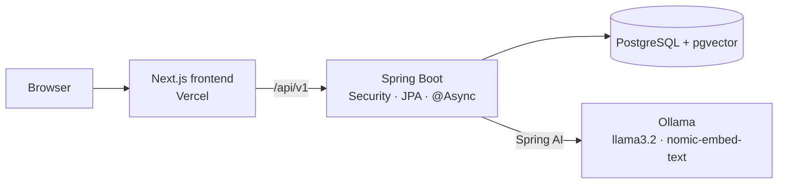

# HotelReviewAI

AI-powered hotel guest review analyzer built with Spring Boot 3, Spring AI, PostgreSQL/pgvector and a Next.js frontend.

**Live demo:** https://hotel-review-two.vercel.app (runs on in-browser sample data; demo login is pre-filled)


## Features

- **Sentiment scoring**: POSITIVE / NEUTRAL / NEGATIVE with a 0–100 score
- **Topic detection**: 13 hospitality topics (cleanliness, staff, food, noise, check-in, …)
- **Manager responses**: a personalized reply draft for every review
- **RAG policy grounding**: relevant hotel policies retrieved from pgvector are injected into the prompt
- **Async pipeline**: background workers with status tracking (Pending → Processing → Completed/Failed), retry, and a heuristic fallback when the LLM is unavailable
- **Analytics dashboard**: sentiment, topic and rating charts, filterable/paginated review list

## Screenshots

| Dashboard | Dashboard (dark) |
|---|---|
|  |  |

| Reviews | Review detail |
|---|---|
|  |  |

## Architecture



Analysis flow: review submitted → queued on an async worker → similar policies retrieved from pgvector → LLM returns structured JSON (sentiment, score, topics, main topic, reply) → stored and shown on the dashboard.

## Tech Stack

| Layer | Technologies |
|---|---|
| Backend | Java 21, Spring Boot 3.4, Spring Security, Spring Data JPA, PostgreSQL |
| AI | Spring AI 1.0, Ollama (llama3.2, nomic-embed-text), pgvector (HNSW, cosine) |
| Frontend | Next.js 16, React 19, TypeScript, Tailwind CSS v4, shadcn/ui, TanStack Query, Recharts |
| Hosting | Vercel (frontend) |

## Quick Start (Local)

1. Start PostgreSQL with pgvector enabled.
2. Start Ollama and pull the required models.
3. Run the application.

## Common Environment Variables

- `DB_URL` (e.g., `jdbc:postgresql://localhost:5432/hotel_review_ai`)
- `DB_USERNAME`
- `DB_PASSWORD` (required)
- `OLLAMA_BASE_URL` (default: `http://localhost:11434`)
- `OLLAMA_CHAT_MODEL` (default: `llama3.2`)
- `OLLAMA_EMBEDDING_MODEL` (default: `nomic-embed-text`)
- `APP_ADMIN_USERNAME` (default: `admin`)
- `APP_ADMIN_PASSWORD` (required)

See `.env.example` for a template.

## Build

```powershell
mvnw.cmd -q test
```

## Run

```powershell
mvnw.cmd spring-boot:run
```

## RAG Setup Note

Pgvector auto-configuration is disabled by default to prevent startup failures when the extension is not installed. Enable it by removing the exclude in `src/main/resources/application.yaml` and setting `app.rag.enabled=true`.

## Web UI (Thymeleaf, served by Spring Boot)

- Dashboard: `http://localhost:8080/dashboard`
- Reviews: `http://localhost:8080/reviews`
- Submit review: `http://localhost:8080/reviews/submit`

Reviews run AI analysis automatically when the chat model is configured. If AI is disabled, the review is still saved and marked as Pending.

## Next.js Frontend

A Next.js frontend lives in `frontend/`. It runs standalone with mock data (the live Vercel demo) or against this backend. See [frontend/README.md](frontend/README.md).

```powershell
cd frontend
npm install
npm run dev
```
